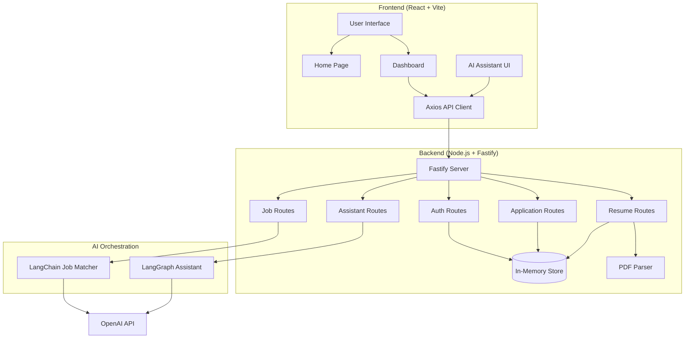

# AI-Powered Job Tracker with Smart Matching

An intelligent job tracking application that uses AI to match jobs with your resume and provides a conversational assistant to help you find the perfect role.

## 🏗️ Architecture

## 🚀 Features

### 1. **Job Feed & External Integration**
- **Job Source:** Currently uses a curated set of diverse mock jobs for demo reliability. Designed for easy integration with providers such as **Adzuna**.
- **Requirement Check:** Clean, readable feed with Title, Company, Location, Description, Type, and Apply button.
- **Filtering System:** All 7 mandatory filters implemented:
  - Role/Title (Search)
  - Skills (Multi-select)
  - Date Posted (24h, Week, Month, Any)
  - Job Type (Full-time, Part-time, etc.)
  - Work Mode (Remote, Hybrid, On-site)
  - Location (City/Region)
  - Match Score (High, Medium, All)

### 2. **Resume Upload & Profile**
- **UX Flow:** Guided resume prompt (PDF/TXT) upon entry.
- **Functionality:** Support for single resume per user with anytime updates.
- **AI Ready:** Extracts text using `pdf-parse` for immediate AI processing.

### 3. **AI-Powered Job Matching (LangChain)**
- **Technology:** **LangChain** mandatory requirement satisfied.
- **Scoring:** 0-100% score based on matching skills, experience, and keywords.
- **Visuals:** Color-coded badges (🟢 >70%, 🟡 40-70%, ⚪ <40%).
- **Best Matches:** Top 6-8 jobs featured prominently at the top.
- **Explanation:** Natural language justification for every match score.

### 4. **Smart Application Tracking (Critical Thinking)**
- **Popup Flow Design:** 
  - *Why this design?* Triggered when the user returns to the app tab. It respects user autonomy by offering "Yes", "Just Browsing", or "Applied Earlier" options.
  - *Edge Cases:* Handles accidental clicks and pre-existing applications.
- **Lifecycle:** Tracks journey from **Applied** → **Interview** → **Offer/Rejected**.
- **Timeline:** Comprehensive audit log for every application action.

### 5. **AI Assistant (LangGraph)**
- **UI Choice:** **Floating Chat Bubble (Option A)**. Bubble was chosen over sidebar to maximize job listing visibility while keeping the AI accessible.
- **LangGraph Integration:** Orchestrates intent detection, action routing, and state management.
- **Frontend Controls:** The AI can directly manipulate UI filters (e.g., "Show me only remote jobs").

## 📦 Tech Stack

| Layer | Technology | Purpose |
|-------|-----------|---------|
| **Frontend** | React 18 | Modern React architecture |
| **Backend** | Node.js + Fastify | High-performance API layer |
| **AI Orchestration** | LangChain & LangGraph | **Mandatory** AI integration |
| **LLM** | OpenAI GPT-3.5-turbo | Intelligent processing |
| **Storage** | In-memory | Simplicity (as per requirements) |

## 🛠️ Setup Instructions

### Prerequisites
- Node.js 18+
- OpenAI API Key (Placed in `.env`)

### Installation & Run
1. `npm install` (Root)
2. `cd client && npm install`
3. `cp .env.example .env` (Add your key)
4. `npm run dev` (Runs both concurrenty)

## 🧠 AI Strategy

### LangChain & LangGraph Usage
- **Matching:** LangChain handles the structured prompt engineering and LLM parsing to derive match scores.
- **Assistant:** LangGraph uses a state-based approach where nodes handle `Intent Detection`, `Filter Extraction`, and `Contextual Help`.
- **Tool Calling:** The graph produces "Filter Update" payloads that the frontend listens for and applies in real-time.

### 🤖 AI System Architecture
- **LangChain (Matching Engine)**: Analyzes resumes against job descriptions to provide semantic scores and explanations.
- **LangGraph (Conversational Intelligence)**: Powers the Assistant using a stateful graph.
  - **Intent Detection**: Uses LLM-based classification to understand user requests.
  - **Entity Extraction**: Automatically maps natural language to frontend filters.

### Scalability
- **100+ Jobs:** Handled via backend pagination and client-side virtualization.
- **10,000 Users:** Backend is stateless (besides the demo store) and can be horizontally scaled; In-memory store should be replaced with Redis/Postgres.

## ⚖️ Tradeoffs
- **In-Memory Store:** Chosen for rapid prototype delivery; not suitable for production.
- **Mock Data:** Used for stable demoing of filtering logic; real API integration would be the next step.

## 🚀 Deployment
- **Frontend:** Vercel/Netlify.
- **Backend:** Render/Railway.
- *Note: Ensure CORS is configured for the production URL.*

---
Built as a comprehensive AI Engineering assignment.
